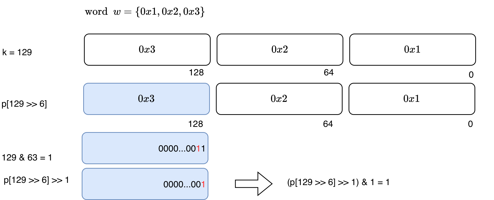
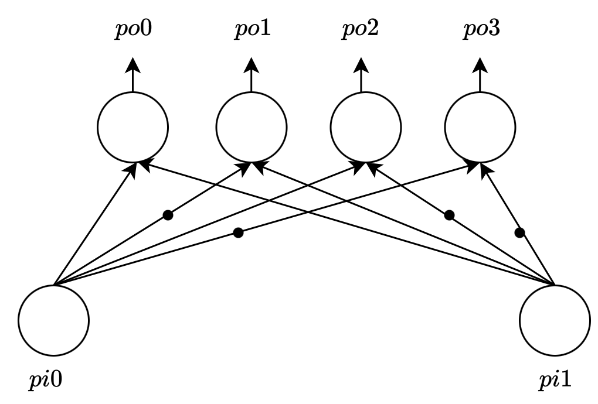
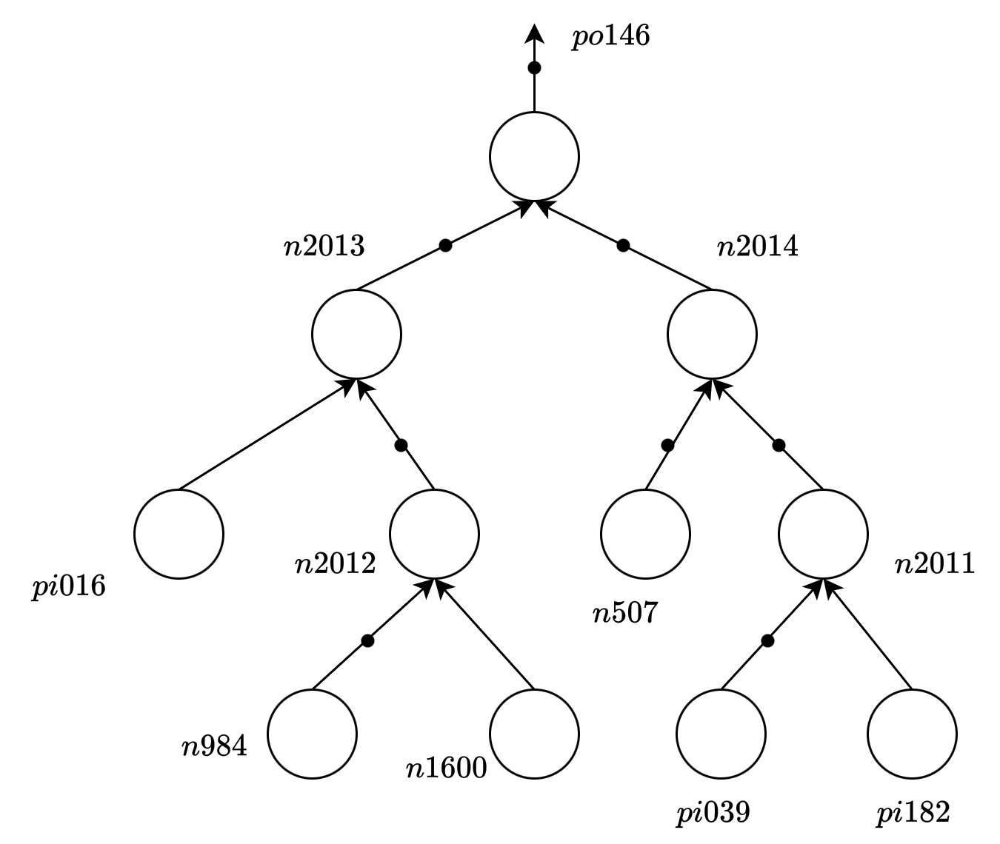
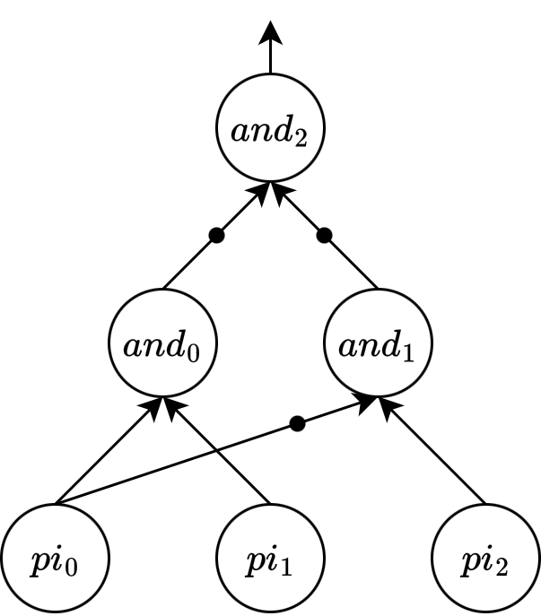
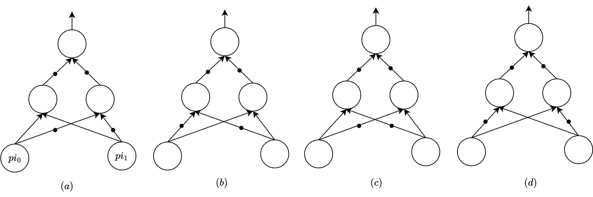

# TestABC
[](https://github.com/wjrforcyber/TestABC/actions/workflows/build-posix.yml)
[](https://github.com/wjrforcyber/TestABC/actions/workflows/build-posix-cmake.yml)

This is a fork version of the original Berkeley's [ABC](https://github.com/berkeley-abc/abc), which I use to write unit test in `test` folder. This probably won't be updated to the upstream since there are too many nit-picky tests, these tests are designed to be as minimum as possible to verify if the implementation align with your concept, and at the same time, help check the bug point if it exists.
<br>These tests would be a set of really helpful tutorials for correctly using each one of the interfaces. 

## 🔨 Build
The test framework is Googletest, it was added in the original ABC in CMake file, simple build with CMake:
```bash
mkdir build
cd build
cmake -DCMAKE_BUILD_TYPE=Debug ..
make
```
> [!TIP]
> I suggest you enable `-DCMAKE_BUILD_TYPE=Debug` to get symbol table, so that you could launch lldb, gdb, etc. to debug if anything goes wrong. This is a simple example, personally I recommend you build it with Ninja, by default full load on threads. You could provide customized namespace if you want. Check workflow file for detail. Or just

```bash
cmake -G Ninja -DCMAKE_BUILD_TYPE=Debug -B build
cmake --build build
```

You could trigger all tests by typing
```bash
cd build
ctest --verbose --output-on-failure
```
Or trigger a single test by
```bash
ctest -R TEST_CASE_NAME --verbose
```

## 🧪 Test list
This section will include all the tests and test suite. Current tests:
```bash
  Test  #1: TTTest.ReadTT
  Test  #2: TTest.InvertWordTT
  Test  #3: TTest.GetWordNum
  Test  #4: TTest.GetBitTT
  Test  #5: GiaTest.CanAllocateGiaManager
  Test  #6: GiaTest.CanAddACi
  Test  #7: GiaTest.CanAddACo
  Test  #8: GiaTest.CanAddAnAndGate
  Test  #9: GiaTest.GiaCollectFanoutInfo
  Test #10: GiaSingleOperation.Gia2Aig
  Test #11: GiaSingleOperation.Aig2Gia
  Test #12: GiaSingleOperation.Gia2AigForOpt
  Test #13: GiaSingleOperation.Gia2AigForOptBack
  Test #14: AigTest.ConstructAig
  Test #15: AigTest.StructureAnalysisAig
  Test #16: AigTest.PhasesAig
  Test #17: AigTest.NameObjAig
  Test #18: AigTest.IsMuxAig
  Test #19: AigTest.IsMuxControlAig
  Test #20: AigTest.RecITEMUXAig
  Test #21: AigTest.IsXORAig
  Test #22: AigTest.SimulationAig
  Test #23: AigTest.SimulationManualCompAig
  Test #24: AigTest.Simulation6InputsAig
  Test #25: AigTest.ReadFromFileAig
  Test #26: AigTest.DuplicateAig
  Test #27: AigTest.LevelTagAig
  Test #28: AigTest.ReverseLevelAig
  Test #29: AigTest.ResubAig
  Test #30: AigTest.ResubSingleNodeAig
  Test #31: AigCutTest.CutTruthVarNumAig
  Test #32: AigCutTest.CutCollect
  Test #33: AigCutTest.CutLeavesSizeCollect
  Test #34: AigCutTest.CutLeavesSizeCollectReal
  Test #35: UtilTest.UtilTruthHexPrint
  Test #36: UtilTest.UtilAddClauses

Total Tests: 36
```

### Truth table
- `TTTest, ReadTT` : Show the direct interface on reading truth table into abc.
  1. Check for case.
  2. Check for ignoring leading `0x`.
  3. Check for MSB(order).
  4. Check for returned number of variables.
  
- `TTest, InvertWordTT` : Get the inverted truth table of specified number of words.

- `TTest, GetWordNum` : Get the required number of (`unsigned long`)words given a specified number of variables.

- `TTest, GetBitTT` : Show the `k`(indexed) bit of a (unsigned long) word array.
This interface works as follows, the `k >> 6` means `k` divides 64, `k & 63` means the modulo operation `k % 64`. So it first **shifts** to the target word and then **shifts** to the moduloed bit in the target word, and then extract it by `& 1`.

<p align="center">
    
</p>

### AIG
- `AigTest, ConstructAig` : Construct a 2 input and 1 output AIG(A single AND node).
- `AigTest, StructureAnalysisAig` : Analysis complemented attributes on simple AIG.
- `AigTest, PhasesAig` : Phases are actually initialized in AIG when you call function `Abc_Obj_t * Abc_AigAnd( Abc_Aig_t * pMan, Abc_Obj_t * p0, Abc_Obj_t * p1 )`. It is determined by 4 factors, the **complemented attributes** and **regular node phases** of both $p_0$ and $p_1$.
<p align="center">
    
</p>

- `AigTest, SimulationAig` : Simulation on every condition of a 2 input AND gate. It shows a way isolated from `resub` to perform an exact simulation.
- `AigTest, SimulationManualCompAig` : Showcase on analyzing simulation on same structure cases with manually changed complemented attributes.
- `AigTest, Simulation6InputsAig` : Give a detailed analysis on a 6-input window from a case i10.aig. Show the exact simulation result in some internal nodes. Check this example to get a deep comprehension about the phases and node encoding process. The window is structured as below:
<p align="center">
    
</p>

- `AigTest, NameObjAig` : Assign name to object in network.
- `AigTest, IsMuxAig` : Detecting if the current node is the root of a MUX. It is detecting a two level AIG, check the inverted attribute of the **children and grand children**. The tested example is shown below:
<p align="center">
    
</p>

- `AigTest, IsMuxControlAig` : Check if the node is MUX control node type. This one uses the case in `AigTest, IsMuxAig`, the control node is the node $pi_0$.
- `AigTest, RecITEMUXAig` : Recognize a MUX and return control("if") node, "then" node, "else" node based on IFE(if-then-else) logic.
> [!NOTE]
> The "then" and "else" nodes can be complemented.

- `AigTest, IsXORAig` : Check if a root node is a XOR/NXOR root node. Since the phase of the root can be changed easily, actually this interface will return true on the following 4 different cases.
> [!NOTE]
> $(a)$ and $(b)$ are XOR and $(c)$ and $(d)$ are NXOR.

<p align="center">
    
</p>

- `AigTest, LevelTagAig` : Calculate level of each AND gate.
> [!NOTE]
> CI levels are 0.

- `AigTest, ReverseLevelAig` : Reverse level calculation and could be used to further calculate the level slack.
> [!NOTE]
> `Abc_ObjRequiredLevel` should be called after `Abc_NtkStartReverseLevels`, or the reverse level `pNtk->vLevelsR` will be `NULL`.

- `AigTest, ResubAig` : Apply resubstitution to a network. This case is from Figure 3.2.2 from [paper](https://people.eecs.berkeley.edu/~alanmi/publications/2006/iwls06_sls.pdf).                                                          

- `AigTest, ResubSingleNodeAig` : Apply resubstitution to a single node. Case is the same as mentioned above.

### Gia
- `GiaTest, GiaCollectFanoutInfo` : Standard process on collecting fanout information.
> [!NOTE]
> The interface `Gia_ObjFanoutNum` can not be used alone, you should call `Gia_ManStaticFanoutStart` and `Gia_ManStaticFanoutStop` before and after the fanout information collection.
- `GiaSingleOperation, Gia2Aig` : `Gia` manager transform to `Aig` manager.
- `GiaSingleOperation, Aig2Gia` : `Aig` manager transform to `Gia` manager with `&cec` interface verified.
- `GiaSingleOperation, Gia2AigForOpt` : ABC9 to ABC for optimization. There's no direct manager in old rw/rf/b, so should be transformed to `Ntk` level. An example of balance is given here.
- `GiaSingleOperation, Gia2AigForOptBack` : ABC9 to ABC for optimization. Then back to `Gia` manager. Omit as much high level structure as possible. An example with `balance` is shown here.


### Cuts
- `AigCutTest, CutTruthVarNumAig` : Testing the number of words needed to be allocated for a number of variables, node that in ABC, a word length is always considered as 32 bits.
- `AigCutTest, CutCollect` : Collecting cuts on a single AND node. Use the example AIG case from `AigTest, Simulation6InputsAig`.
- `AigCutTest, CutLeavesSizeCollect` : Check the cut set difference when modifying the cut max leaf size.
> [!NOTE]
> Trivial cut is always the first one, which only contain the node itself. You will see the check in this example.
- `AigCutTest, CutLeavesSizeCollectReal` : Every node type should have cuts, even only a single trivial one.

### Util
- `UtilTest, UtilTruthHexPrint` : Showing how to print a truth table into a hex format.
> [!CAUTION]
> This interface has a minor issue: You should make sure that the truth `unsigned Sign[]` passed into the interface has absolute length equal or lower than the maximum length according to the `nVars`, if you pass `256` to `3` variable, you will get a `00` instead of `100`. The total number of digits is decided by the `nVars`.

- `UtilTest, UtilAddClauses` : Clause interface, give example to show what it looks like, the lits are based on AIG syntax, variables are index based(roughly divided by 2, positive or negative decided by even/odd lit).